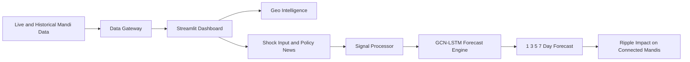

<p align="center">
  
</p>

<p align="center">
  <strong>Not a dashboard. Not just a model. A decision engine for India's mandi ecosystem.</strong>
</p>

<p align="center">
  Real-time mandi intelligence powered by geospatial analytics, graph learning, and policy-aware simulation.
</p>

---

# 🌾 MandiFlow

### From Chaos -> Clarity -> Control

Markets do not move randomly.
They whisper first.

Most people do not hear it.

**MandiFlow does.**

---

# ⚠️ The Invisible Problem

Every single day:

- Prices shift silently
- Supply chains break quietly
- Policies ripple invisibly

And by the time action is taken, the damage is already done.

The problem is not a lack of data.

**The problem is delayed intelligence.**

---

# 💡 Why MandiFlow Exists

```text
Thousands of mandis.
Millions of price updates.
Zero predictive coordination.
```

Data exists everywhere.

But intelligence?

Rarely where it is needed most:
**in real time, before disruption spreads.**

MandiFlow is built to answer three questions:

- 👉 What will happen next?
- 📍 Where will it spread?
- 📉 How bad will it get?

---

# 🚀 What MandiFlow Does

## 📊 1. Live Intelligence Layer

- Fetches live commodity data with resilient fallback architecture
- Maps mandi activity across India with searchable geospatial visualization
- Surfaces market-level pricing signals instantly

## 🔮 2. Predictive Engine

- Uses a hybrid GCN + LSTM architecture
- Learns both spatial and temporal market relationships
- Forecasts price movement across multiple horizons

```text
1 Day  -> Immediate reaction
3 Days -> Short-term shifts
5 Days -> Trend direction
7 Days -> Ripple impact across connected mandis
```

## 🌐 3. Ripple Intelligence

Markets are connected.

MandiFlow tracks:

- Which mandis influence others
- How disruptions propagate through the network
- Which nearby markets may feel the shock next

## 🧾 4. Policy-to-Prediction Engine

Text -> Signal -> Forecast

- Ingests policy updates, news events, and uploaded documents
- Extracts structured shock features using Gemini or heuristic fallback logic
- Converts narrative events into numeric market impact for simulation

## 🔐 5. Secure Access System

- Firebase email/password authentication
- Optional Google OAuth
- Session persistence and refresh logic inside the Streamlit app

---

# 🧠 How MandiFlow Thinks

```text
Raw Market Data
      |
      v
Signal Extraction Layer
      |
      v
Graph Intelligence (GCN)
      |
      v
Temporal Learning (LSTM)
      |
      v
Shock Simulation Engine
      |
      v
Forecast + Ripple Mapping
```

---

# 🔁 System Flow



---

# 🧬 Tech Stack

<p align="center">
  
</p>

```text
UI Layer
Streamlit + Folium + Altair

Data Layer
Pandas + PyArrow Parquet

ML Core
PyTorch + PyTorch Geometric

Intelligence Layer
GCN + LSTM hybrid forecasting

NLP Layer
Gemini API + heuristic fallback

Utilities
SciPy, NumPy, RapidFuzz, pdfplumber
```

---

# 📂 Project Structure

```bash
MandiFlow-main/
|
|-- app.py                       # Main dashboard and user experience
|-- live_engine.py               # Live/parquet/fallback data gateway
|-- simulator.py                 # Shock simulation and ripple forecast logic
|-- model.py                     # GCN-LSTM architecture
|-- train.py                     # Model training pipeline
|-- data_loader.py               # Streaming graph dataset loader
|-- preprocess.py                # Data cleaning and feature engineering
|-- build_graph.py               # Graph adjacency construction
|-- fetch_historical.py          # Historical backfill from government API
|-- daily_updater.py             # Daily parquet catch-up updater
|-- news_analyzer.py             # Policy/news signal extraction
|-- document_processor.py        # PDF/TXT/DOCX ingestion
|-- geocoder.py                  # Market coordinate matching
|-- market_coords.csv            # Geospatial mandi coordinates
|-- mandi_master_data.parquet    # Master historical dataset
|-- mandi_adjacency_*.npz/txt    # Commodity graph topology files
`-- README.md
```

---

# ⚙️ Quick Start

## 1. Clone the repository

```bash
git clone https://github.com/Rajdeep2820/MandiFlow.git
cd MandiFlow
```

## 2. Create a virtual environment

```bash
python -m venv .venv
```

## 3. Activate it

```bash
# Windows
.venv\Scripts\activate

# macOS / Linux
source .venv/bin/activate
```

## 4. Install dependencies

```bash
pip install streamlit pandas numpy pyarrow requests folium streamlit-folium altair scipy scikit-learn torch torch-geometric rapidfuzz pdfplumber google-genai transformers matplotlib seaborn
```

## 5. Run the app

```bash
streamlit run app.py
```

---

# 🔑 Configuration

MandiFlow can run with fallbacks, but these keys unlock the full experience.

## Environment Variables

```env
GEMINI_API_KEY=your_gemini_api_key
FIREBASE_API_KEY=your_firebase_web_api_key
GOOGLE_CLIENT_ID=your_google_client_id
GOOGLE_CLIENT_SECRET=your_google_client_secret
GOOGLE_REDIRECT_URI=your_google_redirect_uri
```

## Streamlit Secrets Alternative

Create `.streamlit/secrets.toml`:

```toml
[firebase]
api_key = "YOUR_FIREBASE_WEB_API_KEY"

[google_oauth]
client_id = "YOUR_GOOGLE_CLIENT_ID"
client_secret = "YOUR_GOOGLE_CLIENT_SECRET"
redirect_uri = "YOUR_GOOGLE_REDIRECT_URI"
```

---

# 🧠 ML Pipeline

```bash
python preprocess.py
python build_graph.py
python train.py --commodity ONION --epochs 50 --lr 0.001
python fetch_historical.py
python daily_updater.py
```

---

# ✨ What Makes This Different

```text
Not just charts.
Not just predictions.
Not just research.
```

MandiFlow is:

- A real-world decision system
- A spatial + temporal market intelligence engine
- A scenario-based forecasting platform
- A bridge between raw data and early action

---

# 🌍 Real Impact

If deployed at scale:

```text
Farmers  -> Better price awareness
Traders  -> Earlier signals
Markets  -> Reduced uncertainty
Systems  -> Smarter interventions
```

---

# 📊 Vision

Today:

```text
Predict mandi prices
```

Tomorrow:

```text
Predict supply chain stress
Predict disruption spread
Predict agricultural market behavior at scale
```

The long-term goal is simple:

**Build intelligence layers for food and agri systems before they fail.**

---

# 🌱 Future Expansion

- Real-time logistics intelligence
- AI anomaly alerts
- Multi-language policy and news ingestion
- Mobile-first market intelligence experience
- Stronger commodity-specific deep forecasting

---

# 🤝 Contributing

Contributions are welcome.

1. Fork the repository
2. Create a feature branch
3. Commit your changes
4. Push your branch
5. Open a pull request

---

# 👨‍💻 Built By

**Naman Mahajan** × **Rajdeep Singh Panwar**

We don’t build dashboards.

We build systems that
**see what others miss**
and **act before others react**.

---

<p align="left">
  ⭐  If this project made you think differently, consider starring it. 
</p>

<p align="left">
  <strong>
The edge isn’t in reacting faster — it’s in knowing earlier.
  </strong>
</p>
